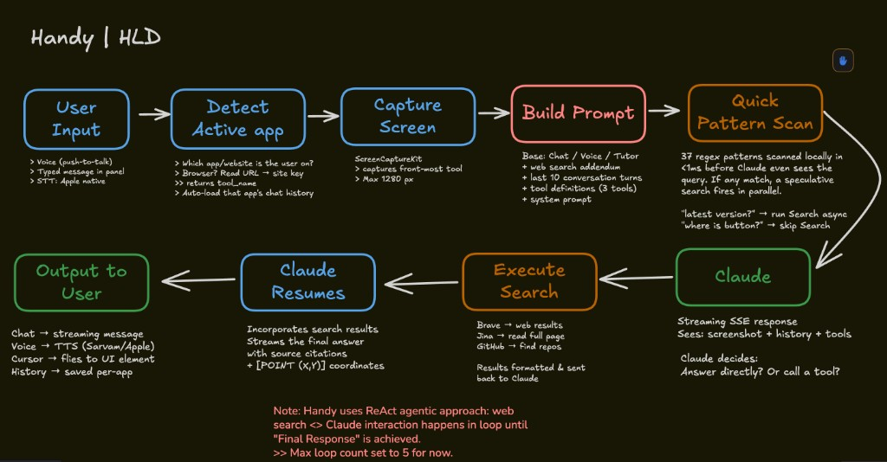

# Handy ✋🏻

> **V2 update:** Handy can now stay with you through short on-screen workflows in the normal guide/help flow. Ask “walk me through this” and it can keep guiding from one click to the next instead of stopping after the first point.
>
> **Also in V2:** Guide mode now uses smarter on-screen grounding and narrower screen capture when it can, so pointing is more reliable and cheaper.
>
> 🔜 **Coming soon:** An even smarter, more autonomous **Handy on Android**.

Handy is a native macOS assistant that lives in your menu bar.

It looks at your screen, listens when you want it to, and talks back—so you can ask “what do I click?” or “what does this mean?” without pasting screenshots into a separate chat window. You can open chat with a keyboard shortcut, the menu bar, or an **optional tiny floating widget** on the edge of the screen. The widget is there if you want a quick tap target without remembering shortcuts. The deeper idea is **context that matches how you actually work**.

Most assistants forget that you were just in Xcode and are now in Slack, or that “Chrome” is not the app you care about—the **website** is. Handy tracks the **focused app and site**, keeps **separate conversation memory per place**, and only sends the **recent, relevant thread** to the model along with a fresh view of your displays. Your secrets stay **on your Mac** in the system Keychain; your chat history stays **local files** on disk—not in someone else’s cloud by default.

When turned on, **web search** lets the model reach out to the internet for answers that need fresh data—without slowing down the questions that don’t.

> [!NOTE]
> A demo video is in [this LinkedIn post that kinda blew up](https://www.linkedin.com/posts/satvikbansal_opensource-ai-ugcPost-7451566626602188800--lHC?utm_source=social_share_send&utm_medium=member_desktop_web&rcm=ACoAACmYNuUBBhrbyLfMJevwXc0cTW5QzyhSWdo).

---



---

## What makes it different

### Smart app switch (tool context)

Plain English: **one brain, many notebooks**—and it flips to the right notebook when you change what you are working in.

When you move from one app to another, you are not having one continuous chat with “the computer”—you are doing different jobs. Handy treats each **focused application** as its own **tool context**.

If you were talking about a bug in your editor and then switch to the browser to check docs, the assistant **switches threads** to match: it loads the history and labels for **that** app, not the previous one. This happens automatically before messages are sent (and when you open the chat panel): the app compares the **current frontmost app** to what it saw last. If you changed apps—or Handy did not yet know a name—it **updates the active tool** and **loads the saved conversation** for that tool.

If Handy itself is frontmost (for example you pulled the chat forward), it **does not throw away** your current context just because the menu bar app is active.

### Layered answers (pointer, bubbles, and the full chat)

Handy does not want you stuck listening to a wall of text.

When you use **voice**, the experience is split on purpose: a **short line** you hear and see near the **companion cursor**, optional **fly-to pointing** at a control, and the **longer story**—shortcuts, alternatives, extra context—in the **chat thread** where you can read at your own pace. Same spirit when you type: the buddy can still **point** while the message in the panel goes deeper. Instructions are **macOS-first** so you are not getting Windows-style shortcuts by mistake.

If something really needs paragraphs instead of “click here first,” the quick version might simply nudge you to **open chat** for the full walkthrough—the detail still shows up in the thread.

### Guided workflows (new in V2)

This is the biggest new piece in V2.

Before, Handy was best at **one answer + one point**. Now, for short on-screen tasks in the normal guide/help flow, it can stay with you for the **next few steps too**.

If you ask something like:

- “walk me through this”
- “show me how to do this”
- “what do I click next”
- “guide me through sending this”
- “help me set this up”

Handy can start a **bounded guided workflow** instead of giving you just one point and stopping there.

The important part: this is **not** Handy asking the model what to do after every click. The model plans a short path once, and then Handy runs that path **locally**. When you click the highlighted target, Handy moves to the next step. That makes it feel much more continuous and much cheaper than re-asking the model every time.

For short “do something here first” moments—typing in a field, waiting for a modal to settle, waiting for a short loading or AI-thinking state—Handy can also **preview the next click** after a short pause. For example: click **Compose**, click into the message field, start typing, and Handy can then say something like **“after you’re done, click Send”** while pointing there.

A few boundaries on purpose:

- Guided workflows are for **short, bounded UI tasks**, not endless autopilot.
- Handy still needs the **first step to be visible now**.
- It stops if things go off-track, the app changes, the target cannot be found, or you ask a new question.
- This lives in the **normal guide/help flow**. **Tutor mode stays separate**.

### Smarter guide grounding (new in V2)

V2 also improves how Handy grounds what is on screen during the guide/help flow.

When it can, Handy builds a **small, safe list of visible actionable UI labels**—buttons, tabs, menu items, toggles, fields—so the model is more likely to name the thing you actually need to click. Handy can also use a **narrower capture** (like the focused window or current screen) when the task clearly lives there, instead of always sending every display.

That helps in three ways:

- **better pointing**
- **lower cost**
- **less junk context**

Sensitive content stays out of that label list. Think **secure fields, passwords, long text bodies, hidden content**—not things the guide flow should be serializing into prompts.

### Floating widget (optional quick access)

If you turn it on in **Settings → Trigger**, a **small pill** stays on screen while chat is **closed**. **Tap** it to open the same chat you would get with **Shift+Space+O**—same tool context and history, not a blank thread.

**Click and drag** anywhere on the pill to move it; the blue companion cursor hides while you drag so it does not sit on top of the widget. The pill is meant to feel like part of the same world as the buddy: **blue waveform** when you are listening, a **spinner** while Handy is thinking, hand when idle, and a **thin amber outline** that turns white on hover—without a dull rectangular backdrop behind the rounded shape. The widget **hides while chat is open** and comes back when you close chat.

It is optional on purpose: some people only want the menu bar and shortcuts. Others like a visible “open Handy” button that does not get in the way.

### Website recognition (browsers are not “the tool”)

For a normal Mac app, the tool name is basically the app name.

**Browsers are different**: the useful identity is usually the **site or product in the tab**, not “Safari” or “Chrome.” Handy uses **Accessibility** (with your permission) to read the **URL from the address bar** when it can, derives the **domain**, and maps many common domains to a **short, human label** (for example GitHub, Notion, Figma). If the domain is unfamiliar, it may still use the domain or a **cleaned window title** (without “— Google Chrome” at the end).

In some cases it can **enrich** the label with a small vision-assisted step so the “tool” name better matches the **website or product** you are actually using—so the model and the saved history line up with **what is on screen**, not just the browser brand.

### Tool-specific chat memory

Each tool name gets its own **persistent chat history**. That means your thread in **Xcode** does not overwrite your thread for **Linear** or **docs on the web**.

When you return to an app, you pick up where you left off for **that** environment. For each request, only a **recent slice** of that tool’s history (the last several turns) is sent to the AI together with the screenshot and your message—enough for continuity, without dumping your entire past into every call.

### Local storage of context

Conversation turns are stored **on disk** under your user’s Application Support folder, as **JSON per tool**.

They are **not** shipped to a Handy server—there isn’t a separate “Handy cloud” for your transcripts in this design. What you keep is **local**, bounded (history per tool is capped), and **keyed by the sanitized tool name** so each context stays separate.

### Local API keys

Provider keys (Claude for the main model, and optional keys for speech or voice providers) are stored in the **macOS Keychain**, not in plain text project files or `.env` on disk. In Settings they can be **masked** in the UI.

You bring your own keys; they stay **on your machine** in the same way other serious Mac apps store credentials.

---

## Features (quick list)

- **Screen-aware AI** — Captures your displays and sends them to Claude so help matches what you see.
- **Visual pointing** — Responses can include `[POINT:x,y:label]` so the companion cursor can **fly toward** a control. The chat message can still carry **extra detail** (shortcuts, other ways to do the same thing) while the pointer favors the clearest on-screen path.
- **Guided workflows (V2)** — In the normal guide/help flow, Handy can keep guiding you through **short multi-step UI tasks** instead of stopping after the first point.
- **Smarter guide grounding (V2)** — Uses safer, more semantic on-screen UI labels and narrower capture when it can, so guide flows are more reliable and cheaper.
- **Voice** — Push-to-talk; default Apple speech (on-device when available); optional OpenAI or AssemblyAI for transcription; system or ElevenLabs for speech output. Spoken output stays **short**; the **full write-up** lands in chat so you can explore more when you want.
- **Floating chat** — Dark, draggable panel with streaming replies and scrollable history. Hover the **status dot** next to the **Handy** title and a little **friendly line** appears (a rotating phrase—think “office hours” energy).
- **Floating widget** (optional) — Tiny on-screen pill to open chat with one tap; draggable; states line up with the buddy; toggle in Settings → Trigger.
- **Web search** (optional) — When enabled, Claude can search the web, read full pages, and find GitHub repos mid-conversation. Only triggers when the question actually needs it; zero overhead otherwise.
- **Tutor mode** — Optional separate mode that watches when you are idle and can nudge you through an app (uses API tokens).
- **Multi-monitor** — Screenshots all displays and maps coordinates sensibly.

---

## Keyboard shortcuts

| Shortcut | Action |
|----------|--------|
| `Shift + Space + O` | Open chat |
| `Control + Z` | Start/stop voice input |

You can also open chat from the **menu bar** hand menu or the **floating widget** (if enabled in Settings → Trigger). Custom hotkeys are planned for a future version.

### During an active guided workflow

A workflow should **keep going on its own** after your original question. You should not have to keep re-triggering Handy between steps.

Here is how it behaves:

| Action | What happens |
|--------|---------------|
| Click the highlighted target | Handy moves to the next step |
| Click into a field and start typing | Handy can preview the next click after a short pause |
| Wait through a short read/watch/load/generate moment | Handy can preview the next click after a short delay |
| Press `Control + Z` during a workflow | Handy **pauses** the workflow and starts listening for a new voice query |
| Stop voice input with no real query | Handy **resumes** the paused workflow |
| Ask a new question instead | Handy **cancels** the old workflow and switches to the new one |

---

## Quick start (non-technical): zip, Cursor, run

Handy is a normal Mac app you build with **Xcode**. You do not have to be a programmer to try it—if you can install Xcode, use a terminal, and use **Cursor** (or another AI editor), you can get running with a short checklist.

### What you need

- A Mac on **macOS 14 (Sonoma) or later**
- **Xcode** from the Mac App Store (large download). Open it once after install so it can finish installing components.
- Enough comfort with **Terminal** to paste a command when needed
- Optional but practical: **Cursor** so you can open this folder and ask an assistant to help you build and run the app

### Easiest path

1. Download this repository as a **zip**, unzip it, and open the **`Handy`** folder in **Cursor** (or open that folder in Finder and drag it onto Cursor).
2. Ask the AI something concrete, for example: *“I have Xcode installed. Open `Handy.xcodeproj`, build the Handy target, and tell me how to run it.”* or *“Spin up Handy from this repo.”* It should point you to **Xcode** → open the project → **⌘B** (Build) and **⌘R** (Run).
3. When Handy launches, macOS may ask for **Accessibility**, **Screen Recording**, **Microphone**, and **Speech Recognition**—grant what you need for the features you want.
4. Use the **menu bar** hand icon → **Settings** → add your **Claude API key** (it stays in your **Keychain**).

After that, you are good to go.

### Restarting Handy from Terminal (after you have built once)

Sometimes you want to **quit any running copy** and **start Handy again** without opening Xcode.

The built app lives under Apple’s **DerivedData** folder; the exact folder name **includes a random suffix and is different on every Mac**, so treat long paths below as **examples**—use *your* path after you have built at least once (Finder search for `Handy.app` under `Library/Developer/Xcode/DerivedData`, or ask Cursor where the Debug build landed).

**Option A — run the app executable directly** (example path from one developer machine; **replace with your path**):

```bash
killall Handy 2>/dev/null
"/Users/satvik.bansal/Library/Developer/Xcode/DerivedData/Handy-fwxommusmtuzyscczbhbhyghwaok/Build/Products/Debug/Handy.app/Contents/MacOS/Handy" &
```

**Option B — shorter command** (works if there is only one `Handy-*` DerivedData folder; otherwise use the full path to your `Handy.app`):

```bash
killall Handy 2>/dev/null
open "$HOME/Library/Developer/Xcode/DerivedData"/Handy-*/Build/Products/Debug/Handy.app
```

---

## Setup

### Requirements

- macOS 14.0 (Sonoma) or later
- Xcode 16+ to build
- A **Claude API key** from [Anthropic](https://console.anthropic.com/)

### Build and run

1. Open `Handy.xcodeproj` in Xcode (or build from the `Handy/` directory if you use Swift Package Manager workflows).
2. Build and run (⌘R).
3. Grant prompts for **Accessibility** (hotkeys, local UI grounding, and, for browsers, URL reading), **Screen Recording**, **Microphone**, and **Speech Recognition** as needed.
4. From the menu bar hand icon, open **Settings**.
5. Under **Brain**, add your **Claude** key (stored in Keychain).
6. Use **Shift+Space+O** for chat or **Control+Z** for voice.

Optional: **Settings → Trigger** → turn on **Floating access widget** for a small on-screen button to open chat.

### API keys (all local)

| Provider | Role | Required |
|----------|------|----------|
| **Anthropic (Claude)** | Main assistant | Yes |
| **OpenAI** | Optional STT | No |
| **AssemblyAI** | Optional STT | No |
| **ElevenLabs** | Optional TTS | No |
| **Brave Search** | Web search (when enabled) | No |
| **Jina Reader** | Full page reading (when search enabled) | No |
| **GitHub** | Repo/package search (when search enabled) | No |

Keys are **only** in Keychain from the app’s perspective—not duplicated in repo files.

---

## Architecture

```text
Handy/
├── HandyApp.swift                    # App entry (@main)
├── AppDelegate.swift                 # Menu bar, lifecycle
├── DesignSystem.swift                # Colors, type, spacing
├── Info.plist                        # LSUIElement, usage descriptions
├── Handy.entitlements                # Sandbox off, audio/network
├── Models/
│   ├── ChatMessage.swift
│   ├── AppSettings.swift             # Mode, STT/TTS providers (UserDefaults)
│   ├── ScreenCapture.swift
│   ├── GuidedWorkflowPlan.swift      # Bounded multi-step guide plan
│   ├── GuidedWorkflowStep.swift      # Per-step semantic target + policy
│   ├── WorkflowSessionState.swift    # Active workflow state
│   └── WorkflowContinuationPolicy.swift
├── Services/
│   ├── HandyManager.swift            # Orchestration, tool switch, browser resolution
│   ├── ClaudeAPIService.swift        # Streaming API + tool-use
│   ├── ScreenCaptureService.swift    # Multi-display capture, focused app, browser URL
│   ├── SpeechRecognitionService.swift
│   ├── TTSService.swift
│   ├── HotkeyManager.swift
│   ├── ChatHistoryManager.swift      # Per-tool JSON in Application Support
│   ├── OverlayManager.swift
│   ├── WorkflowRunner.swift          # Local multi-step guide engine
│   ├── ClickDetector.swift           # Advances only on real user clicks
│   ├── SemanticElementResolver.swift # AX-first local grounding for guide flows
│   ├── WorkflowActivityMonitor.swift # Typing / wait-state preview timing
│   └── AccessibilityMarksProvider.swift # Safe visible UI labels for guide flows
├── Views/
│   ├── ChatPanelManager.swift
│   ├── ChatInterfaceView.swift
│   ├── SettingsView.swift
│   ├── WorkflowChecklistView.swift   # Active guided workflow UI
│   └── WorkflowInlineControlView.swift
├── FloatingAccessWidget/
│   ├── FloatingAccessWidgetController.swift # Small optional panel
│   ├── FloatingAccessWidgetView.swift       # SwiftUI chrome
│   ├── FloatingAccessoryInteractionView.swift # Drag vs tap, hover
│   └── TranslucentFloatingChromeViews.swift # Transparent hosting shell for the pill
└── Utilities/
    ├── KeychainManager.swift
    ├── PointParser.swift
    ├── WorkflowIntentDetector.swift   # When to start a guided workflow
    ├── WorkflowPlanValidator.swift    # Bounds + safety checks
    ├── WorkflowControlPhraseDetector.swift # stop / retry / skip / resume
    └── GuideCapturePolicy.swift       # Focused-window vs all-screens capture
```

---

## How a typical request flows

1. **You trigger** voice or open chat.
2. **Tool resolution** runs: if the focused app changed, Handy **switches tool context** and **loads that tool’s history**. For browsers, it prefers **URL / site identity** over the raw browser name.
3. **Screenshots** are taken. In normal guide/help flows, Handy can use a **narrower capture policy** (for example the focused window or current screen) when that is clearly enough.
4. **Claude** receives the images, your message, system instructions, and **recent turns for this tool only**.
5. If it is a normal request, **streaming text** fills the chat; optional **pointing** and (for voice) **short TTS** run on the reply, while the chat keeps the **full written answer**.
6. If it is a guided workflow request, Handy can start a **local workflow runner** instead: it validates the short plan, resolves the first target, points there, and then continues locally after your clicks.
7. For short type/watch/read/wait moments inside that workflow, Handy can **preview the next click** after a short pause—without treating the step as magically “done.”
8. The exchange is **appended to local history** for **that tool**.

---

## Guided workflows in plain English

The V2 workflow layer is meant to feel continuous, but still bounded.

### What happens

- Claude plans a **short path once**
- Handy checks that the path is sane
- Handy makes sure the **first click is visible now**
- Handy points to the current target
- **Your click** moves the workflow forward
- Handy resolves the next step **locally**
- For short type/watch/read/wait moments, Handy can **preview** the next click early

### What does **not** happen

- Handy does **not** ask Claude what to do after every click
- Handy does **not** keep running forever
- Handy does **not** assume a timer means a step is complete
- Handy does **not** silently continue in the wrong app

### When it stops

Handy stops a workflow if:

- the flow finishes
- the app/site context changes too much
- the next target cannot be found
- the workflow sits around too long
- you press **Stop**
- you ask a new question

That is deliberate. The goal is not “autopilot forever.” The goal is **a much better, more continuous guide flow** for the short tasks people actually ask all day.

---

## Web Search (optional, add-on layer)

Most of what you ask Handy—“where is the export button,” “what does this error mean”—can be answered from the screenshot and the model’s own knowledge.

But sometimes you need something the model can’t know from memory: the latest version of a framework, whether a Swift package exists for a particular task, or how to fix an error code that only shows up on Stack Overflow. That’s what web search mode is for.

### How it works

You flip a toggle in **Settings → Brain → Web Search**. That’s it. Everything else stays the same.

When search mode is on, Handy sends Claude three **tool definitions** alongside your normal request: `web_search`, `fetch_page`, and `github_search`. Claude reads your question and **decides on its own** whether it needs to look something up. If it doesn’t, the answer streams back at the same speed as before—zero overhead. If it does, you’ll see a brief “Searching the web…” pause (typically 1–3 seconds), and then a response grounded in real, current information.

### How Claude decides

The tool descriptions tell Claude **when** to search, not just what the tools do.

The rules are baked into the tool definition itself:

**Search when:**

- The question is about **latest versions, recent releases, or anything after early 2025**
- The user wants to **find a package, library, SDK, or repo**
- It’s about **installation or setup** (“how to install,” “pip install,” “SPM package”)
- There’s an **error code or message** with no obvious fix
- The question is about **compatibility** (“does X support Y”)
- The user asks about **specific API usage or documentation**
- It involves **changelogs, release notes, or breaking changes**

**Don’t search when:**

- The question is about **UI navigation** (“where is this button”)—that’s what the screenshot is for
- The user wants a **code review** of something visible on screen
- It’s a **general concept** the model knows well (“what is a closure”)
- The answer is **clearly visible** in the screenshot already

### The three tools

| Tool | Backed by | What it does | Cost |
|------|-----------|-------------|------|
| **web_search** | Brave Search API | Searches the web and returns top results with titles, snippets, and URLs | ~$0.005/query |
| **fetch_page** | Jina Reader API | Reads the full content of a web page and returns clean markdown | Free tier (~200 req/day) |
| **github_search** | GitHub REST API | Finds repositories by query and language, returns stars, descriptions, last update | Free (10 req/min unauth, 30 with token) |

**Why these three?** Brave has its own independent search index (no Google/Bing dependency), scores well in agentic benchmarks, and is fast (~600ms). Jina and GitHub are **free APIs**—Jina’s free tier gives you about 200 page reads per day, and GitHub’s search endpoint is free even without a token. The total incremental cost for a typical user is around **$2–5/month**.

### API keys

All three keys are stored in the **macOS Keychain**, same as your Claude key. You enter them once in Settings and they persist across launches—no re-entry, no plain-text files on disk.

| Key | Required for search? | Where to get it |
|-----|---------------------|----------------|
| **Brave Search** | Yes | [brave.com/search/api](https://brave.com/search/api/) |
| **Jina Reader** | No (optional, for full page reading) | [jina.ai](https://jina.ai/) |
| **GitHub Token** | No (optional, raises rate limit) | [github.com/settings/tokens](https://github.com/settings/tokens) |

---

## Apple Speech Recognition notes

Default STT uses `SFSpeechRecognizer`: on Apple Silicon, **on-device** mode is used when available; otherwise server-based recognition.

Locale defaults to `en-US`. Apple imposes a **continuous recognition time limit** per session; for heavy jargon, consider OpenAI or AssemblyAI in Settings.

---

## License

Bansal Labs®
